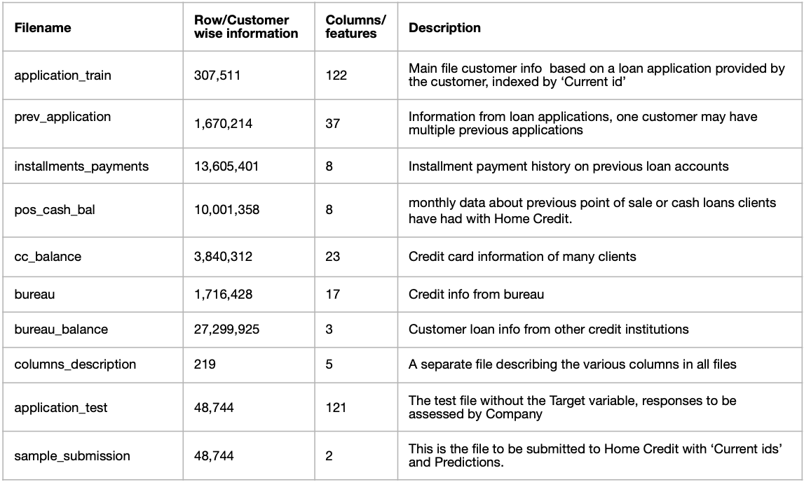
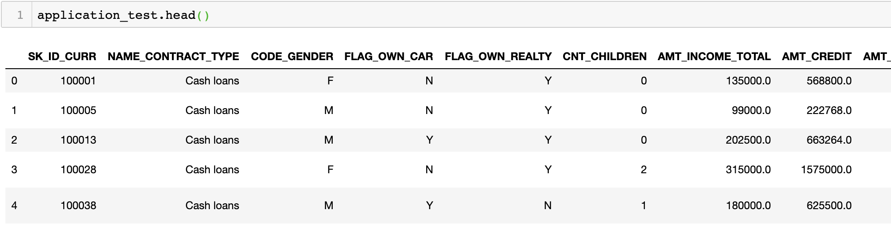
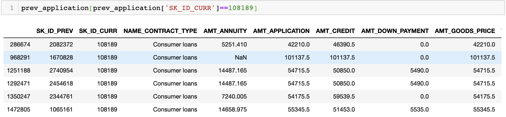
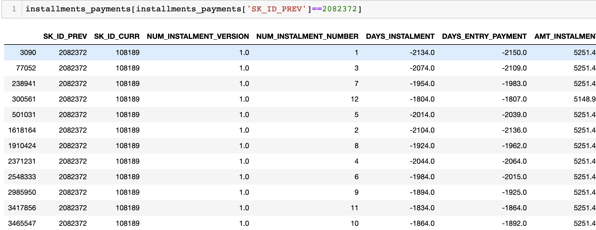
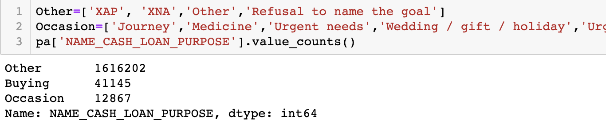
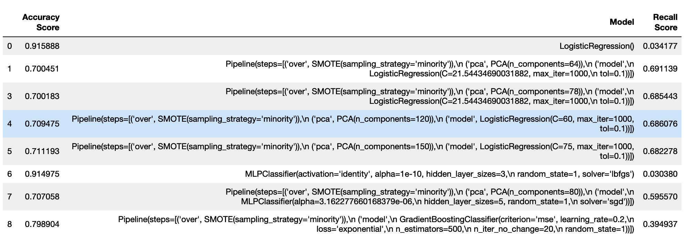

# Capstone-Project Overview
__Home Credit__ 

I have provided below a quick snapshot of the steps taken in completing my Capstone Project.

While searching for the main course Project (called CapStone at General Assembly), I decided that the Project should include application of all the tools and models that I have learned in my intensive 3 months Data Science course at GA, which meant it should have a medium to advanced application of python programming skills, data cleaning, statistical modelling as well as language processing. However, since time was of essence, I finally decided on a Project by ‘Home Credit’ which I found on Kaggle. While it did not require much NLP skills (or any), it did require a lot of feature engineering and modelling expertise, which I thought is what I can settle for as of now and can then take up an NLP side project in the future.

Home Credit, a  is an international non-banking financial company which provides loans to customers with no or not enough credit history who traditionally may not be able to get financed by banks or other NBFCs.

This Project is about predicting customers who will default based on information provided by a detailed loan application and other records including previous loan/payment records of the same customers as well credit-bureau information and external credit information from other sources.
The Company has separately provided test data on which the competing teams will have to submit their predictions. Since I am doing this as part of my Course and may not be able to get my predictions verified from Home Credit as the Project is way past its due date, I will be splitting up the training data into train and test segments.

A quick overview of all the files is below:

This is a standard supervised classification problem. 
Every row in the application_train file corresponds to information provided by the customer in the loan application at the time of applying. Every row also has a ‘Target’ label with values 0 (customer paid on time) and 1(customer had difficulty paying). Looking at the above table, one can observe that we have been provided with information of 307,511 customers in the training file.

Target Analysis:
The first aspect to be noticed is that ‘baseline Accuracy’ is at ~91% which means its’ a case of imbalanced classification and hence will require us to consider various ways of sampling data.
The above means that 91% of customers repay on time and 9% have problems. So if we were to make a model which predicts all customers as 0 (means paying on time) then we will still achieve an accuracy rate of 91%. So alongside accuracy, what matters more then is how many of the customers do we correctly predict, which is also called ‘Recall’. Hence our objective is to optimise on ‘Recall’ and ‘Accuracy’ scores. 

A quick overview of the how the files look:

__EDA snapshot:__
Did some quick EDA to understand the data, have provided just a very brief snapshot.
For eg., a general thought is that people with real estate ownership would default less, however, as per the data provided the ratio of defaults this isn’t true in our case.

Also, below is a representation of how defaults are spread on a map of credit and annuity.

__Getting Started:__

The best way to get started is to do data cleaning on the main application_train file, visualise the data and run a baseline model (like logistic regression) to check how it fares in terms of accuracy and recall.
On doing that I got an accuracy of 91% (as expected) but a recall of ~14% (very bad).

So, as a next step, I will go through all the other files and merge all the relevant data with the application_train file. And this will require a lot of feature engineering and manipulation. If I decide to aggregate features without any manipulation, it would result in feature sets that numbered in thousands (~1500), and it’s very likely that many, if not most, of those features are redundant, noisy, or both.

My approach will be :
 - Keep all features while trying to remove less correlated features 
 - While trying to make them more effective as predictors
 - Create new features based on industry knowledge
   * For eg. apply time based weights to previously delayed payments
   * Similarly on any refused applications

Some notes:
Since there are so many features, 
1. I was attracted to the possibility of converting some continuous features to discrete for eg. no of Children, family size. Number of children ranged from  0 to 19 across all customer applications.

2. Bundling of feature labels so as to make it better for the model to estimate, the example below is from the ‘previous applications’ file where one of the features is about the purpose of cash loan availed by the customers :

 
3. Created new features based on information provided, for eg. The following feature (graphically represented) was created by using chronological weights on payment delays or defaults, it shows how the defaults are spread is on a graph between this new feature and the credit amount, as can be seen, it does a good job at concentrating the defaults.

There are many more features that I converted/developed using the above methodologies. To be sure, there is no way to know if the above feature transformations help in improving accuracy and recall scores, other than by comparing scores from before and after. While there are studies available which indicate the above might help in decision trees. 

__Modelling__

  

Finally, I wanted to see how a Logistic Regression model, without sampling, would work. And the results, as expected, fared well on Accuracy, however, the Recall scores were extremely bad indicating, that the model was not predicting the labels correctly. 

So I applied SMOTE which improved the Recall score quite drastically, however, I am still working to improve the scores further.

